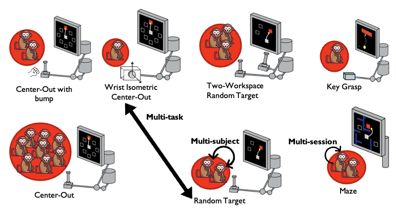
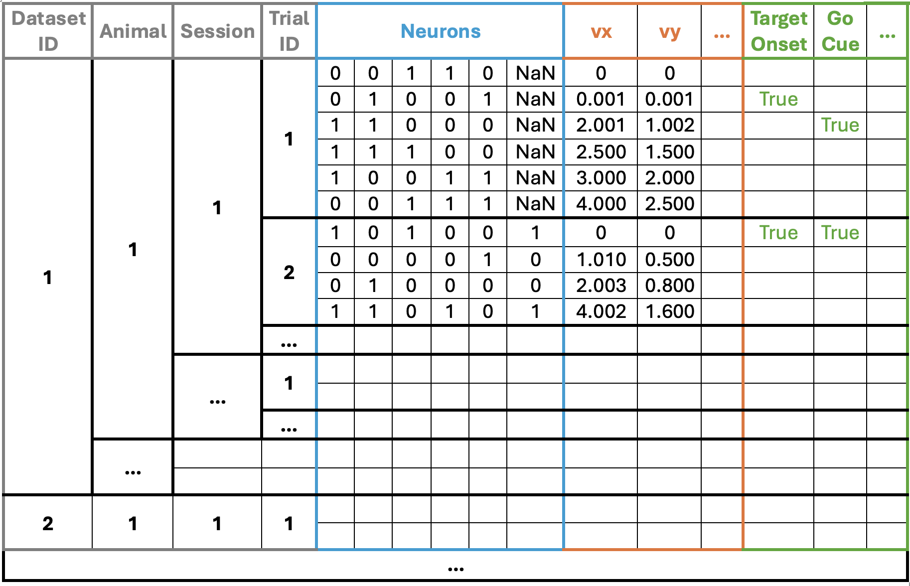

# The NeuroTask Benchmark Dataset

NeuroTask is a benchmark dataset designed to facilitate the development of accurate and efficient methods for analyzing multi-session, multi-task, and multi-subject neural data. It integrates six datasets from motor cortical regions, comprising `148 sessions` from `17 subjects` engaged in `7 distinct tasks`.
The figure here shows an illustration.




## Dataset Download

**The public dataset suite is available for download through [Kaggle](https://www.kaggle.com/datasets/carolinafilipe/neurotask-multi-tasks-benchmark-dataset).** 

- **If you are using the web user interface**, you can download all data from the provided [link](https://www.kaggle.com/datasets/carolinafilipe/neurotask-multi-tasks-benchmark-dataset). The download button is at the upper right corner of the webpage.

- **If you would like to use the Kaggle API**, please follow the instructions [here](https://github.com/Kaggle/kaggle-api). After setting the API correctly, you can simply use the command below to download all data.

```
kaggle datasets download -d carolinafilipe/neurotask-multi-tasks-benchmark-dataset
```

## Using the NeuroTask Dataset



The dataset schema is comprised of:

* Indexes for dataset,animal, session and trial
* Neurophysiological data.
* Behavior covariates.
* Events time indications.

Each row represents a single time step.

For more information on each of these components, please consult the provided [datasheet]().

## Loading the Dataset
We developed an API, `api_neurotask.py`, to streamline data loading and preprocessing tasks, such as data rebinning and alignment to specific start event with adjustable offsets. You can find the api tutorial here: [tutorial](tutorial_data_analysis.ipynb).

## Repository Structure

In this repository, you will find the code necessary to replicate the experiments of the presented paper.

The [first notebook](tutorial_data_analysis.ipynb) regards the loading, processing and visualization of the data.

The [second notebook](tutorial_baselines.ipynb) presents the code to reproduce the benchmark results in the manuscript. 

## License \& Acknowledgement
The NeuroTask benchmark dataset is released under a [CC BY-NC 4.0 International License](https://creativecommons.org/licenses/by-nc/4.0). Our code implementation (api and baselines) is released under the [MIT License](https://opensource.org/licenses/MIT). We would also like to express our gratitude to the authors of baselines for releasing their code.

## Contact Us
Please feel free to contact us if you have any questions about NeuroTask: carolina.filipe@research.fchampalimaud.org


